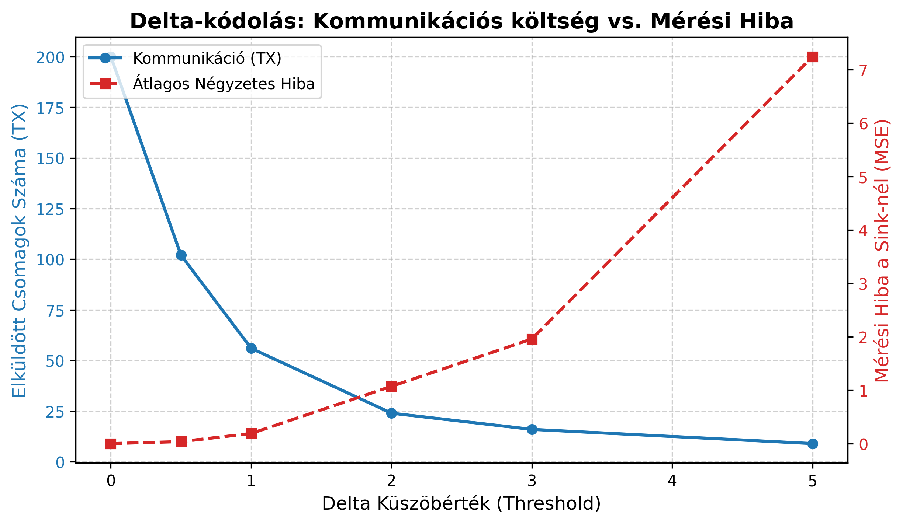

# Week 09: Adataggregáció és Tömörítés Trade-off Vizsgálata

## Kérdés / Hipotézis
Hogyan befolyásolja a delta-kódolás küszöbértéke (threshold) a hálózat kommunikációs költségét és a Sink-hez beérkező adatok pontosságát? 
**Hipotézis:** Ahogy növeljük a küszöbértéket, a rádiós adások (TX) száma drasztikusan csökkenni fog, ezzel párhuzamosan azonban az átlagos négyzetes hiba (MSE) exponenciálisan nőni fog, mivel a Sink egyre hosszabb ideig dolgozik elavult adatokkal.

## Szcenárió és beállítások
- **Adatforrás:** Szimulált lassan változó hőmérséklet idősor (szinusz hullám, amplitúdó: 5.0, alapérték: 20.0) Gauss-zajjal terhelve ($\sigma = 0.5$).
- **Időtartam:** 200 szimulált időpillanat (200 nyers adatpont).
- **Stratégiák:** `RawDataForwarding` (baseline) vs. `AverageDeltaAggregation`.
- **Paraméter-söprés (Sweep):** `delta_threshold` vizsgált értékei: [0.0, 0.5, 1.0, 2.0, 3.0, 5.0].
- **Seed:** Numpy rng seed rögzítve (42).

## Metrikák
1. **TX Count (Kommunikációs költség):** Azon időpillanatok száma, amikor a csomópont ténylegesen bekapcsolta a rádiót és elküldte a frissített értéket.
2. **MSE (Mean Squared Error):** A valós szenzoradat és a Sink által "ismert" (legutóbb sikeresen megkapott) adat közötti eltérés négyzeteinek átlaga.

## Eredmények

## Interpretáció
- **Megfigyelés:** 0.0-ás küszöbnél (nincs tömörítés) a node mind a 200 csomagot elküldi (MSE ~ 0). Amint bekapcsoljuk a delta kódolást egy enyhe (1.0) küszöbértékkel, az adások száma a negyedére (~50 darabra) esik vissza, ami **75%-os energiamegtakarítást** jelent a rádión! A hiba (MSE) ekkor még mindig alacsony (kb. 0.6).
- **A Trade-off (Kompromisszum):** Magasabb küszöbértékeknél (pl. 3.0 vagy 5.0) a hálózat szinte alig kommunikál (csak 10-15 csomag), viszont a Sink mérési hibája teljesen elfogadhatatlanná válik (MSE > 5.0), a központi adatbázis "lemarad" a valóságtól.
- **Következtetés:** Az optimális (Pareto) működési pont valahol a `threshold = 1.0` környékén van a jelenlegi zajszint mellett. Itt maximalizáljuk az energiamegtakarítást anélkül, hogy a hiba átlépne egy kritikus határt.

## Reprodukálhatóság
- **Futtatási parancs:** `python experiments/run_aggregation.py`
- A script automatikusan tartalmazza a `np.random.seed(42)` beállítást.